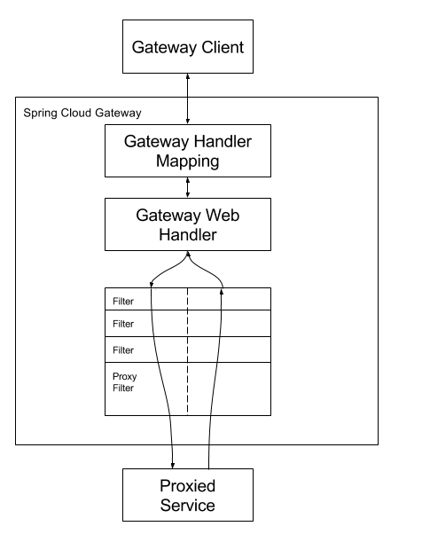

## 网关

API 网关是系统的唯一入口，对外封装了系统的内部结构，包含了统一接入、协议适配、流量管理与容错、以及安全防护等核心功能。

外部请求由网关统一接入，然后将请求的协议转换成内部的接口协议，在调用的过程中还要有限流、降级、熔断等容错的方式来保护网关的整体稳定，同时网关还要做到基本的安全防护（防刷控制），以及黑白名单（比如IP白名单）等基本安全措施。


### Gateway

Spring Cloud Gateway 在 Spring 生态的基础上了构建了 API 网关，提供一种简单而有效的方法来路由到api，并为它们提供跨领域的关注点，例如：安全性、监视/度量和恢复能力。

Spring Cloud Gateway 是基于 SpringBoot2.x 以及 Spring WebFlux 上，即其是采用 Netty 构建的异步框架，因此不能在基于 Servlet 的容器中运行。

Spring Cloud Gateway 有三个核心概念：
- `Route`：网关的基本模块，由 ID，目标地址 URI、断言集合和过滤器集合定义，如果断言为 true 则表示路由匹配，断言可以有多个，必须每个断言为 true 才真正为 true
- `Predicate`：输入类型是一个 ServerWebExchange，我们可以使用它来匹配来自 HTTP 请求的任何内容，例如 headers 或参数
- `Filter`：`GatewayFilter` 的实例，通过过滤器可以用于修改请求和响应

工作流程：

- 客户端向 SpringCloudGateway 发出请求
- 如果 HandlerMapping 中找到与请求相匹配的路由，将其发送到 `WebHandler`
- Handler 再通过指定的过滤器链来将请求发送到我们实际的服务执行业务逻辑，然后返回
- 过滤器之间用虚线分开是因为过滤器可能会在发送代理请求之前（“pre”）或之后（“post”）执行业务逻辑

Spring Cloud Gateway 配置：
```yaml
spring:
  cloud:
    gateway:
      - id: after_route
        uri: https://example.org
        predicates:
        # 使用 Cookie 断言，只有 key, value 匹配时才返回 true
        - Cookie=mycookie,mycookievalue
```

#### Predicate
SpringCloudGateway 将路由作为 HandlerMapping 基础的一部分进行匹配，SpringCloudGateway 中包含多个内置的 `RoutePredicateFactory`，不同的 `RoutePredicateFactory` 匹配 HTTP 请求的不同属性，可以将多个不同的 `RoutePredicateFactory` 进行组合。
- `AfterRoutePredicateFactory`：接受 ZonedDateTime 类型的参数 datetime，匹配在该时间之后发生的请求
  ```yaml
  spring:
    cloud:
      gateway:
        - id: after_route
          uri: https://example.org
          predicates:
            - After=2017-01-20T17:42:47.789-07:00[America/Denver]
  ```
- `BeforeRoutePredicateFactory`：接受 ZonedDateTime 类型的参数 datetime，匹配在该时间之前发生的请求
  ```yaml
  spring:
    cloud:
      gateway:
        - id: before_route
          uri: https://example.org
          predicated:
            - Before=2017-01-20T17:42:47.789-07:00[America/Denver]
  ```
- `BetweenRoutePredicateFactory`：接受 ZonedDateTime 类型的参数 datetime1 和 datetime2，匹配发生在 datetime1 之后以及 datetime2 之前的请求
  ```yaml
  spring:
    cloud:
      gateway:
        - id: between_route
        - uri: https://example.org
        - 
  ```
  
自定义 `RoutePredicateFactory` 通常采用继承 `AbstractRoutePredicateFactory` 并且实现对应的方法，在配置时 predicated 的名字为自定义类名的前缀，如 `PrefixPredicateFactory` 对应的配置为 `Prefix`

#### Filter

过滤器允许修改传入的 HTTP 请求或者返回的 HTTP 响应，过滤器的作用域为特定路由。SpringCloudGateway 包含许多内置的 `GatewayFilterFactory`
