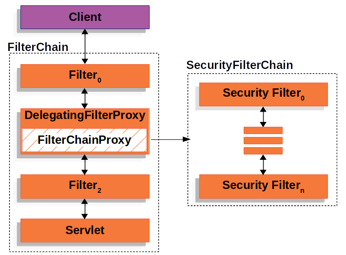

## Spring Security

Spring Security 使用标准的 Servlet Filter 与 Servlet 容器集成，也就是说 Spring Security 可以和任何运行在 Servlet 容器中的应用程序一起工作。

Spring 提供了 `DelegatingFilterProxy` 过滤器用于在 Servlet 容器的生命周期和 Spring 的 `ApplicationContext` 之间建立桥梁。`DelegatignFilterProxy` 通过 Servlet 容器机制注册，但是将所有工作委托给实现 Filter 的 Spring Bean。

### 启动原理

使用 @EnableWebSecurity 注解时向容器中注入自动配置类 `WebSecurityConfiguration` 用于创建过滤器链 (SecurityFilterChain) 并完成安全配置工作。

Spring 上下文会调用 `WebSecurityConfiguration#setFilterChainProxySecurityConfigurer` 方法对 WebSecurity 进行初始化，然后利用 WebSecurity 在 `springSecurityFilterChain` 方法中创建

SpringSecurityFilterChain 的初始化过程中会调用

`ExceptionTranslationFilter` 用于处理过滤器链抛出的 `AccessDeniedException` 和 `AuthenticationException`, 如果检测到抛出的一场是 `AccessDeniedException` 则会启动 `AuthenticationEntryPoint`, 如果检测到抛出的异常为 `AccessDeniedException` 则会判断是否是匿名用户,如果启动 `AuthenticationEntryPoint` 否则会采用 `AccessDeniedHandler`来处理.

`ExceptionTranslationFilter` 为 Java 异常和 HTTP 响应之间建立起了关联

### Authentication

Authentication 是验证用户身份的合法性。

- AuthenticationManager：认证的管理类，所有需要认证的请求都是通过 AuthenticationManager 的 authenticate 方法完成认证，并根据认证的结果调用具体的 Handler 来处理
- AuthenticationProvider：具体实现请求的认证，一个 provider 是一种认证方式的实现，Spring Security 提供了多种认证方式
- Authentication：表示由 AuthenticationManager 的 authenticate 方法完成认证后的认证请求或者已认证的主体的令牌。一旦身份认证完成之后就会将 Authentication 存储在当前认证机制使用的 SecurityContextHolder 管理的 Thread-Local 的 SecurityContext 中。除非 Authentication 的 authenticated 属性设置为 true，否则后续的安全相关的拦截器会再次认证

### Authorization

Authentication 对象中保存了一个 GrantedAuthority 列表，表示请求主体已经获取的授权。GrantedAuthority 对象通过 AuthenticationManager 插入到 Authentication 对象中，并且由 AccessDecisionManager 在做出授权决策时读取。

Spring Security提供了拦截器，用于控制对安全对象（如方法调用或web请求）的访问。AccessDecisionManager将在调用前决定是否允许继续调用。

### JWT

### OAuth

https://www.jianshu.com/nb/29347401

https://blog.csdn.net/u012702547/article/details/89629415