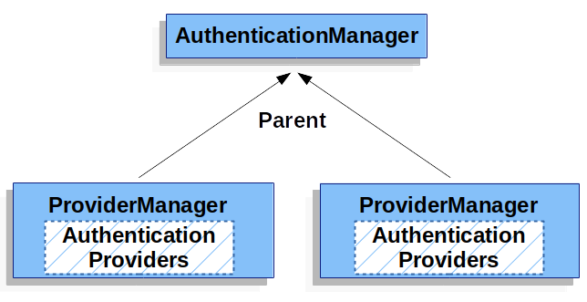

## Spring Security

Spring Security 使用标准的 Servlet Filter 与 Servlet 容器集成，也就是说 Spring Security 可以和任何运行在 Servlet 容器中的应用程序一起工作。

### FilterChain

Spring 提供了 `DelegatingFilterProxy` 作为 Servlet 容器的和 Spring 的 `ApplicationContext` 之间的桥梁。`DelegatignFilterProxy` 实现了 Servlet 的 `Filter` 接口，在 `doFilter` 方法中将请求代理给  `FilterChainProxy` 处理，`FilterChainProxy` 是 Spring 提供的一个由容器管理的特殊的 `Filter`，容器在初始化时创建名为 `springSecurityFilterChain` 的 `FilterChainProxy`。


```java
DelegatingFilterProxy#initBean
    
   WebSecurityConfiguration#springSecurityFilterChain
```


#### Filter

`Filter` 通过  `SecurityFilterChain` 插入到  `FilterChainProxy` 中，`Filter` 插入的顺序决定了拦截请求的顺序。  `Spring Security` 提供了大量的 `Filter` 组件用于过滤请求：

- `CorsFilter`
- `CsrfFilter`
- `OAuth2LoginAuthenticationFilter`
- `UsernamePasswordAuthenticationFilter`
- `BasicAuthenticationFilter`
- `ExceptionTranslationFilter`
- ...


#### `ExceptionTranslationFilter`

`ExceptionTranslationFilter`  是插入到 `FilterChainProxy` 的一种过滤器，可以将后级过滤器或者应用程序抛出的 `AccessDeniedException` 和 `AuthenticationException`  翻译成 HTTP 响应。


在 `ExceptionTranslationFilter#doFilter` 方法中，整个处理逻辑为：

- 直接执行 `chain.doFilter(request, response)` 执行后续的处理
- 如果后续处理抛出 `AuthenticationException` 则会调用 `sendStartAuthentication` 方法处理异常
- 如果后续处理抛出 `AccessDeniedException`，则会判断是否是 `Anonymous` 或者 `RememberMe`，如果是则调用 `sendStartAuthentication`  方法处理，否则调用 `accessDeniedHandler#handle` 处理

`sendAuthentication` 方法处理认证失败的异常，处理过程包含三步：

- 将 `SecurityContext` 中保存的 `Authentication` 清除，因为发生认证异常说明当前的 `Authentication` 失效
- 缓存 `HttpServletRequest` 和 `HttpServletResponse` 到 `RequestCache` 中，因为当后续认证成功后需要从缓存中获取原始的请求和响应
- 调用 `AuthenticationEntryPoint` 从客户端获取用户认证凭证，例如重定向到登录页面

`accessDeniedHandler#handle` 方法处理权限不足的异常，

todo

> **Tips**
>
> 如果后续处理没有抛出异常，或者抛出的异常不是 `AuthenticationException` 或者 `AccessDeniedException` 则 `ExceptionTranslationFilter` 不会有任何的处理。


#### `AbstractAuthenticationProcessingFilter`


### AutoConfiguration

Spring Security 使用 `@EnableWebSecurity` 实现自动配置，该注解向容器中注入自动配置类 `WebSecurityConfiguration` 。


Spring Security 使用`@EnableWebSecurity` 启动，用于创建过滤器链 (SecurityFilterChain) 并完成安全配置工作。

Spring 上下文会调用 `WebSecurityConfiguration#setFilterChainProxySecurityConfigurer` 方法对 WebSecurity 进行初始化，然后利用 WebSecurity 在 `springSecurityFilterChain` 方法中创建


#### Spring Boot

Spring Boot 在引入`spring-security-starter` 后会自动配置 Spring Security，核心配置为 `SecurityFilterAutoConfiguration`。


### Authentication

`Authentication` 是验证试图访问特定资源的用户的身份的方法，一旦用户身份得以认证就可以根据身份执行授权。

在  Spring Security 中，请求经过需要认证的 `Filter` 时会触发认证流程，Spirng Security 提供了用于不同机制的身份认证框架，包含几个核心组件：

- `SecurityContext`：从 `SecurityContextHolder` 获取，保存了当前已认证的用户的身份信息
- `Authentication`：用户的认证信息，可以传入 `AuthenticationManager` 用于认证

- `AuthenticationManager`：认证的管理类，所有需要认证的请求都是通过 `AuthenticationManager` 完成认证，并根据认证的结果调用具体的 Handler 来处理
- `AuthenticationProvider`：请求认证的具体实现，每一种 `AuthenticationProvider` 对应一种认证方式的实现


#### `SecurityContext`


`SecurityContext` 由 `SecurityContextHolder` 维护，包含了用户凭据 Authentication 对象。Spring Security 并不关心 `SecurityContext` 如何处理用户凭证对象，只要是包含该对象则认为将其认为当前已经认证的用户。


基于 Spring Security 的这种特性，可以直接向其中设置 `Authentication` 对象完成用户认证从而绕过 Spring Security 的认证体系：

```java
// 创建一个新的 SecurityContext 而不是使用原有的，避免多线程安全问题
SecurityContext context = SecurityContextHolder.createEmptyContext();
Authentication authentication = 
    new TestingAuthenticationToken("username", "password", "ROLE_USER");
context.setAuthentication(authentication);
SecurityContextHolder.setContext(context);
```

默认情况下 `SecurityContextHolder` 使用 `ThreadLocal` 策略来存储 `SecurityContext`，这意味着在相同线程中的任何方法都可以安全的获取 `SecurityContext` 并且在请求处理完成之后清除。

除了 `ThreadLocal` 策略存储 `SecurityContext`，`SecurityContextHolder` 还提拱了多种存储策略，包括：

- `MODE_THREADLOCAL`：ThreadLocal 策略
- `MODE_INHERITABLETHREADLOCAL`：线程和其派生的线程共享 `SecurityContext`
- `MODE_GLOBAL`：所有的线程共享 `SecurityContext`

通过实现 `SecurityContextHolderStrategy` 接口可以自定义 `SecurityContext` 存储策略，指定存储策略有两种方式：

- 启动应用时添加参数 `-Dspring.security.strategy=MODE_GLOBAL` 或者设置系统属性 `spring.security.strategy=MODE_GLOBAL`
- 调用 `SecurityContextHolder#setStrategyName` 指定策略类名(自定义策略)或者策略名(Spring Security 提供)

```java
// 使用参数
java -jar -Dspring.security.strategy=MODE_GLOBAL application.jar

// 使用代码
SecurityContextHolder.setStrategyName(SecurityContextHolder.MODE_GLOBAL);
```


#### `Authentication`

Spring Security 中 `Authentication` 有两个主要的作用：

-  作为 `AuthenticationManager`  的输入提供用于认证的凭证，此时 `isAuthenticated()` 方法返回 `false`
- 表示已经经过认证的用户，可以从 `SecurityContext` 中获取到用户认证信息，此时 `isAuthenticated()` 方法返回 `true`


`Authentication` 中包含几个核心属性：

- `principal`：表示请求认证的用户，在使用用户名/密码进行身份认证时通常是一个 `UserDetail` 实例
- `credentials`：表示认证的凭据，通常是密码，一般在用户通过认证之后就会被清除以免造成泄露
- `authorities`：`GrantedAuthority` 的集合，表示用户被授予的权限，如角色或者作用域


`GrantedAuthority` 表示认证用户被授予的权限，这些权限通常是“角色”，如 `ROLE_ADMINISTRATOR` 或者 `ROLE_HR_SUPERVISOR`，这些角色会用于后续的方法授权、领域对象授权等。

一般情况下 `GrantedAuthority` 表示应用程序范围内的权限，而不是表示具体领域对象的权限，在需要控制具体领域对象的权限时应该使用项目具体的权限控制。


`Authentication` 接口有一些实现类，各自应用与不同的场景：

- `TestingAuthenticationToken`

- `UsernamePasswordAuthenticationToken`


#### `AuthenticationManager`

`AuthenticationManager` 定义了 Spring Security 的过滤器如何执行身份认证。Spring Security 的过滤器通过 `AuthenticationManager` 完成身份认证后会将认证信息 `Authentication` 存放在 `SecurityContext` 中。

`ProviderManager` 是 `AuthenticationManager` 的一个常用的实现类，`ProviderManager` 管理一个 `AuthenticationProvider` 列表，每个 `AuthenticationProvider` 都可以认证自己支持的身份认证机制或者交由下游 `AuthenticationProvider` 进行认证，如果所有配置的 `AuthenticationProvider`  都不能执行认证则表示认证失败并抛出 `ProviderNotFoundException` 的异常，这个异常是一种特殊的 `AuthenticationException` 异常，用于表明 `ProviderManager` 没有配置支持当前的 `Authentication` 。



默认情况下，`ProviderManager` 会尝试将已经认证的 `Authentication` 中的敏感信息清除，但是这样在使用用户对象缓存的时候可能会导致问题。如果 `Authentication` 中包含了缓存对象的一个引用(比如 `UserDetail` 实例)，如果清除了凭证(credentials)则后续将不可能通过缓存的值进行身份认证。


`ProviderManager` 中可以注入多个 `AuthenticationProvider`，每个 `AuthenticationProvider` 表示一种特殊的认证机制，Spring Security 内置了多种 `AuthenticationProvider` 可以直接使用，也可以通过实现 `AuthenticationProvider` 接口来自定义认证机制：

- `DaoAuthenticationProvider`
- `JwtAuthenticationProvider`
- ...


#### `AuthenticaionEntryPoint`

`AuthenticationEntryPoint` 用于发送向客户端请求认证凭证的 HTTP 响应。在一些情况中，请求携带了用户名/密码等凭据来请求资源，此时 Spring Security 不需要提供向客户端请求认证凭据的 HTTP 响应；但是在一些没有携带凭据但是请求需要认证的资源时，`AuthenticationEntryPoint` 就用于向客户端请求认证凭据，此时`AuthenticationEntryPoint` 的实现类通常是重定向到登陆页面或者返回带有 `WWW-Authenticate` 头的响应。

#### UserName/Password

用户名/密码认证是一种常见的认证方式，Spring Security 内置了多个基于用户名/密码认证的机制，包括：

- `Form Login`
- `Basic Authentication`
- `Digest Authentication`
- `In-Memory Authentication`
- `JDBC Authentication`
- `LDAP Authentication`

##### `Form Login`

Spring Security 提供了通过 html 的表单提供用户名和密码进行认证，重定向到登录表单页面一般通过以下流程触发：

- 未经认证的用户请求了需要授权的资源
- `FilterSecurityInterceptor` 鉴定请求未经认证，抛出 `AccessDeniedException`
- 由于请求未经认证，`ExceptionTranslationFilter` 经由 `LoginUrlAuthenticationEntryPoint` 将请求重定向到登录页面
- 浏览器请求重定向的登陆了页面，填写用户名和密码后发起登录请求

携带用户名和密码的登录请求会被 `UsernamePasswordAuthenticationFilter` 处理，`UsernamePasswordAuthenticationFilter` 是 `AbstractAuthenticationProcessingFilter` 的子类，其处理流程如下：

- 


### Authorization

`Authentication` 对象中保存了 `GrantedAuthority` 列表，表示请求主体已经获取的授权。`GrantedAuthority` 对象通过 `AuthenticationManager` 插入到 `Authentication` 对象中，并且由 `AccessDecisionManager` 在做出授权决策时读取。


Spring Security提供了拦截器，用于控制对安全对象（如方法调用或web请求）的访问。AccessDecisionManager将在调用前决定是否允许继续调用。

#### AccessDecisionManager

`AccessDecisionManager` 负责权限控制，由 `AbstractSecurityInterceptor` 在访问被保护的方法之前调用，决定被保护的方法是否允许调用。`AccessDecisionManager` 接口定义了三个方法，其中 `decide` 方法根据传入的参数决定是否授权，参数 `object ` 表示需要被授权检查的方法，如果拒绝访问就会抛出 `AccessDeniedException`

##### Vote-Based AccessDecisionManager

自定义 `AccessDecisionManager` 的实现类可以实现不同的授权机制，Spring Security 提供了一些基于投票(Vote) 机制的 `AccessDecisionManager` 实现类：

- `AffirmativeBased`：只要收到一个 `ACCESS_GRANTED` 的投票则会授予访问权限，如果全部都是 `ACCESS_ABSTAIN`  则会根据参数 `allowIfAllAbstainDecisions` 来确定是否授予权限，默认为 `false` 
- `ConsensusBased`：如果收到的 `ACCESS_GRANTED` 投票数大于等于 `ACCESS_DENIED` 投票数则会授予权限，如果全部都是 `ACCESS_ABSTAIN`  则会根据参数 `allowIfAllAbstainDecisions` 来确定
- `UnanimousBased`：只要收到一个 `ACCESS_DENIED` 投票则不予授权，如果全部为 `ACCESS_ABSTAIN` 则根据参数 `allowIfAllAbstainDecisions` 来确定

`Vote-Based` 机制的授权机制包括一系列的 `AccessDecisionVoter` 实现类，`AccessDecisionManager` 根据这些 `AccessDecisionVoter` 的投票结果来决定是否抛出 `AccessDeniedException`。

`AccessDecisionVoter` 接口定义了三个方法，其中 `vote` 方法表示进行投票，方法返回值是 `int` 类型，取值是 `AccessDecisionVoter` 的静态属性 `ACCESS_ABSTAIN`、`ACCESS_DENIED` 、`ACCESS_GRANTED` 之一。当表决器不能做出决定时返回 `ACCESS_ABSTAIN`，否则返回 `ACCESS_DENIED`  或者 `ACCESS_GRANTED` 。

#### AccessDecisionVoter

`AccessDecisionVoter` 接口是授权时的投票器，`AccessDecisionManager` 根据这些投票的结果确定是否授予权限。

实现 `AccessDecisionVoter` 接口可以自定义投票器，Spring Security 内置了两种常见的投票器用于实现特定的投票机制：

- `RoleVoter`：将传入的 `ConfigAttribute` 参数作为角色名，然后根据当前用户的角色投票。如果 `GrantedAuthority` 返回的 字符串对象是以 `ROLE_` 开头并且和 `ConfigAttribute` 参数相匹配则返回 `ACCESS_GRANTED`，如果不匹配则返回 `ACCESS_DENIED`，如果 `ConfigAttribute` 参数中没有以 `ROLE_` 开头的则返回 `ACCESS_ABSTAIN`

- `AuthenticatedVoter`：

### JWT

### OAuth
