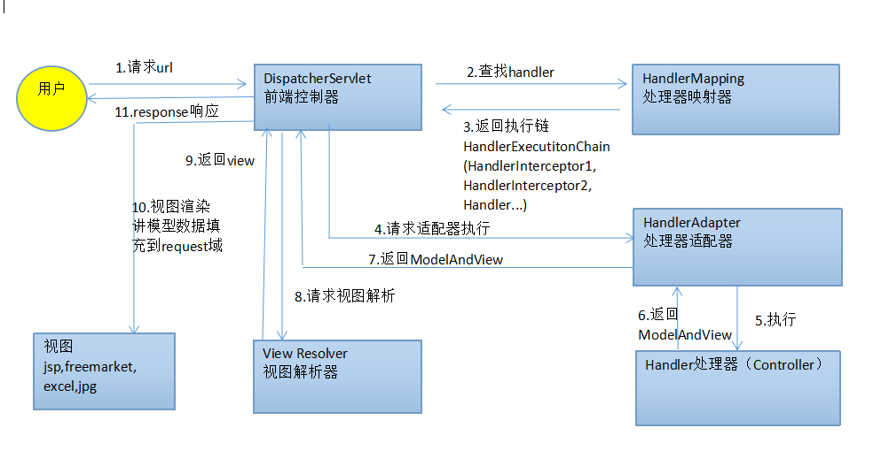

## WebMVC

Spring Web MVC 是 Spring 提供的基于 Servlet 的 Web 框架，使用 Spring Web MVC 框架开发的 Web 应用程序需要运行在 Servlet 容器中。

### Initializer

Servlet 容器在启动应用时会加载 `web.xml` 文件，并根据文件的内容初始化应用的 `Servlet` 及其对应的 `ServletContext`。

```xml
<!-- 配置 Servlet -->
<servlet>
    <servlet-name>springmvc</servlet-name>
    <servlet-class>org.springframwork.web.servlet.DispatcherServlet</servlet-class>
</servlet>
<!-- 配置 Listener -->
<listener>
    <listener-class>org.springframework.web.context.ContextLoaderListener</listener-class>
</listener>
```

`web.xml` 文件中需要配置应用启动的 Servlet 并指定初始化时对应的 ServletContext 的配置文件，并设置了 `ContextLoaderListener` 来监听 `ServletContext` 的加载事件。

#### WebApplicationInitializer

Servlet 3.0 为了支持以 Java 编程的方式替代 `web.xml` 来配置，提供了 `ServletContainerInitializer` 接口，通过 SPI 机制加载 `META-INF/services/javax.servlet.ServletContainerInitializer` 文件中配置的实现了该接口的类并实例化。

容器启动时会调用加载的 `ServletContainerInitializer` 实现类的 `onStartup` 方法并传入该实现类的 `@HandlesTypes` 注解中的类。Spring 提供了 `SpringServletContainerInitializer` 类实现了 `ServletContainerInitializer` ，因此在 Servlet 容器启动时会实例化并调用 `onStartup`方法：

```java
// 遍历所有传入的 Class，只保留类上通过 @HandlesTypes 注解的 WebApplicationInitializer 类
for (Class<?> waiClass : webAppInitializerClasses) {
	// Be defensive: Some servlet containers provide us with invalid classes,
	// no matter what @HandlesTypes says...
	if (!waiClass.isInterface() && !Modifier.isAbstract(waiClass.getModifiers()) &&
		WebApplicationInitializer.class.isAssignableFrom(waiClass)) {
	try {
		initializers.add((WebApplicationInitializer)											// 实例化保留下来的类
        ReflectionUtils.accessibleConstructor(waiClass).newInstance());
	}
	catch (Throwable ex) {
		throw new ServletException("Failed to instantiate WebApplicationInitializer class", ex);
	}
}


// 实现类进行排序并依次调用 onStarup 方法
AnnotationAwareOrderComparator.sort(initializers);
for (WebApplicationInitializer initializer : initializers) {
	initializer.onStartup(servletContext);
}
```

 `SpringServletContainerInitializer#onStartup` 方法实例化所有实现 `WebApplicationInitializer` 接口的类并在排序后依次调用 `onStartup` 方法。通过实现 `WebApplicationInitializer` 就可以自定义 Web 应用：

```java
public void MyWebApplicationInitializer implements WebApplicationInitializer {
    
    @Override
    public void onStartup(ServletContext servletContext) throws ServletException {
    	// ...
    }
}
```

#### WebApplicationContext

`DispatcherServlet` 在创建的时候需要参数 `WebApplicationContext`，实现了 `ApplicationContext`

- `XmlWebApplicationContext`

- `AnnotationConfigWebApplicationContext`

### DispatcherServlet

Spring MVC 的架构是基于前端控制器(DispatcherServlet)设计的，HTTP 请求都是由 DispatcherServlet 代理并通过设置的 HandlerMapping 将请求映射到对应的处理器链(HandlerExecutionChain),然后通过 HandlerAdapter 适配的处理器链完成请求的处理,请求处理的结果由 DispatcherServlet 代理给 ViewResolver 渲染后返回,从而完成整个 HTTP 请求.



Dispatcher 是 Spring MVC 框架的中央处理器,所有的请求都会通过 DispatcherServlet 完成处理并返回渲染后的结果.

Dispatcher 并没有直接参与请求的处理以及结果的渲染,而是通过代理给其内部的组件完成这些功能.Spring MVC 为 DispatcherServlet 的内部组件提供了默认的实现,并将这些 bean 交由容器来管理,通过自定义这些 bean 可以扩展或者替换它们:
- HandlerMapping：将请求映射到 handler 和 拦截器链用于预处理和后处理，映射的条件取决于不同的实现类
- HandlerAdapter：将不同的处理器处理方法适配到统一的方法中并处理方法参数,数据绑定,消息转换等
- HandlerExceptionResolver：请求映射或者请求处理过程中的异常处理接口
- ViewResolver：渲染处理器返回的处理结果为真正的视图

`DispatcherServlet` 在 Servlet 容器初始化之后的 `onRefresh` 方法中会初始化内部的组件,在初始化组件的过程中会先到容器中获取,如果没有获取到则会到 `DispatcherServlet.properties` 中获取定义的默认的组件:
```java
public class DispatcherServlet extends FrameworkServlet {

    // Servlet 容器初始化后调用
    protected void onRefresh(ApplicationContext context) {
        initStrategies(context);
    }

    // 初始化内部组件
    protected void initStrategies(ApplicationContext context) { 
        initMultipartResolver(context);
        initLocaleResolver(context);
        initThemeResolver(context);
        initHandlerMappings(context);
        initHandlerAdapters(context);
        initHandlerExceptionResolvers(context);
        initRequestToViewNameTranslator(context);
        initViewResolvers(context);
        initFlashMapManager(context); 
    }
}
```
`DispatcherServlet` 始化完内部组件后就可以对外提供 web 服务了,基于 Servlet 容器的 Web 应用的 HTTP 请求会在 Servlet 的 `doService` 中被处理, `DispatcherServlet` 在 `doService` 中通过 `setAttribute` 方法设置一些后续需要使用的属性之后调用 `doDispatch` 来真正处理请求:
```java
public class DispatcherServlet extends FrameworkServlet {
    
    protected void doDispatch(HttpServletRequest request, HttpServletResponse response) throws Exception { 
        HttpServletRequest processedRequest = request;
        HandlerExecutionChain mappedHandler = null;
        boolean multipartRequestParsed = false;
        
        WebAsyncManager asyncManager = WebAsyncUtils.getAsyncManager(request);
        
        try { 
            ModelAndView mv = null;
            Exception dispatchException = null;
            
            try {
                // 如果是文件流请求则处理,返回 MultipartHttpServletRequest
                processedRequest = checkMultipart(request);
                multipartRequestParsed = (processedRequest != request);
                
                // Determine handler for the current request.
                mappedHandler = getHandler(processedRequest);
                if (mappedHandler == null) { 
                    noHandlerFound(processedRequest, response);
                    return; 
                }
                
                // Determine handler adapter for the current request.
                HandlerAdapter ha = getHandlerAdapter(mappedHandler.getHandler());
                
                // Process last-modified header, if supported by the handler.
                String method = request.getMethod();
                boolean isGet = "GET".equals(method);
                if (isGet || "HEAD".equals(method)) { 
                    long lastModified = ha.getLastModified(request, mappedHandler.getHandler());
                    if (new ServletWebRequest(request, response).checkNotModified(lastModified) && isGet) { 
                        return; 
                    } 
                }
                
                // 执行处理器链中的 interceptor 的 preHandle 方法
                if (!mappedHandler.applyPreHandle(processedRequest, response)) { 
                    return; 
                }
                
                // Actually invoke the handler.
                mv = ha.handle(processedRequest, response, mappedHandler.getHandler());
                
                if (asyncManager.isConcurrentHandlingStarted()) { 
                    return; 
                }
                
                applyDefaultViewName(processedRequest, mv);
                // 执行处理器链中的 interceptor 的 postHandle 方法
                mappedHandler.applyPostHandle(processedRequest, response, mv); 
            } 
            catch (Exception ex) { 
                dispatchException = ex; 
            } 
            catch (Throwable err) {
                // As of 4.3, we're processing Errors thrown from handler methods as well,
                // making them available for @ExceptionHandler methods and other scenarios.
                dispatchException = new NestedServletException("Handler dispatch failed", err); 
            }
            // 处理请求的结果
            processDispatchResult(processedRequest, response, mappedHandler, mv, dispatchException); 
        } 
        catch (Exception ex) { 
            triggerAfterCompletion(processedRequest, response, mappedHandler, ex); 
        } 
        catch (Throwable err) { 
            triggerAfterCompletion(processedRequest, response, mappedHandler,
                    new NestedServletException("Handler processing failed", err)); 
        } 
        finally { 
            if (asyncManager.isConcurrentHandlingStarted()) {
                // Instead of postHandle and afterCompletion
                if (mappedHandler != null) { 
                    mappedHandler.applyAfterConcurrentHandlingStarted(processedRequest, response); 
                } 
            } 
            else {
                // Clean up any resources used by a multipart request.
                if (multipartRequestParsed) { 
                    cleanupMultipart(processedRequest); 
                } 
            } 
        } 
    }
}
```
`doDispatch` 是 `DispatcherServlet` 的核心, 对 HTTP 请求的处理都包含在其中.方法中首先通过 `checkMultipart` 方法对文件上传请求进行了处理,之后通过 `getHandler` 方法调用其 `RequestMapping` 组件获取到请求对应的 `HandlerExecutionChain`,之后调用 `getHandlerAdapter` 方法将处理器链适配到 `HandlerAdapter`,这时 `DispatcherServlet` 准备好了对该请求处理需要的所有组件.

在真正处理请求之前 `DispatcherServlet` 还会检查请求头的 `last-modified` 值,

请求的处理包含三步:执行处理器链中所有的`HandlerInterceptor` 的 preHandle 方法,执行适配类 `HandlerAdapter` 的 handle 方法,执行执行器链中所有的 `HandlerInterceptor` 的 postHandle 方法完成请求的处理.

请求处理完成之后的结果由 `processDispatchResult` 方法处理,这个方法除了渲染请求处理返回的 `ModelAndView` 外,还通过 `HandlerExceptionResolver` 全局处理请求映射和处理过程中出现的异常.

#### HandlerMapping

HandlerMapping 负责映射 URL 和对应的处理类，`DispatcherServlet` 在启动时调用 `initHandlerMappings` 方法，该方法会从容器中加载 `HandlerMapping` 的实现类,如果没有指定就使用默认配置`DispatcherServlet.properties`中的实现:
```java
public class DispatcherServlet extends FrameworkServlet {

    private void initHandlerMappings(ApplicationContext context) {
        this.handlerMappings = null;
    
        if (this.detectAllHandlerMappings) {
            // Find all HandlerMappings in the ApplicationContext, including ancestor contexts.
    		Map<String, HandlerMapping> matchingBeans =
    			BeanFactoryUtils.beansOfTypeIncludingAncestors(context, HandlerMapping.class, true, false);
    		if (!matchingBeans.isEmpty()) {
    		    this.handlerMappings = new ArrayList<>(matchingBeans.values());
    		    // We keep HandlerMappings in sorted order.
    		    AnnotationAwareOrderComparator.sort(this.handlerMappings);
    		}
        }
        else {
            try {
                // 从容器中加载名称为 handlerMapping 的 HandlerMapping bean
                HandlerMapping hm = context.getBean(HANDLER_MAPPING_BEAN_NAME, HandlerMapping.class);
                this.handlerMappings = Collections.singletonList(hm);
            }
            catch (NoSuchBeanDefinitionException ex) {
                // Ignore, we'll add a default HandlerMapping later.
            }
        }
    
        // Ensure we have at least one HandlerMapping, by registering
    	// a default HandlerMapping if no other mappings are found.
    	if (this.handlerMappings == null) {
            // 获取配置文件中指定的默认的实现
    	    this.handlerMappings = getDefaultStrategies(context, HandlerMapping.class);
    	    if (logger.isTraceEnabled()) {
    	        logger.trace("No HandlerMappings declared for servlet '" + getServletName() +
    					"': using default strategies from DispatcherServlet.properties");
    	    }
    	}
    }
}
```
在初始化 `HandlerMapping` 时可以从容器中获取多个 bean 并且将这些 bean 排序, 通过实现 `Ordered` 接口可以实现自定义排序 `HandlerMapping`,从而使得其可以按照优先级的顺序来处理请求和处理类的映射.

`DispatcherServlet` 中通过调用 `getHandler` 方法为请求映射处理类,方法中通过遍历已经排序的 `HandlerMapping` 并调用其 `getHandler` 方法获取对应的 `HaandlerExecutionChain`:
```java
public class DispatcherServlet extends FrameworkServlet {

    protected HandlerExecutionChain getHandler(HttpServletRequest request) throws Exception {
        if (this.handlerMappings != null) {
            // handlerMappings 已经排序
            for (HandlerMapping mapping : this.handlerMappings) {
                HandlerExecutionChain handler = mapping.getHandler(request);
                if (handler != null) {
                    return handler;
                }
            }
        }
        return null;
    }
}
```
`HandlerMapping` 接口定义了 `getHandler` 方法接收 `HttpServletRequest` 并返回 `HandlerExecutionChain`,其中包含了该请求对应的处理类以及对应的 `HandlerInterceptor` 列表
```java
public interface HandlerMapping {
    
    // 返回包含拦截器和请求处理类的对象
    HandlerExecutionChain getHandler(HttpServletRequest request) throws Exception;
}
```
Spring 在配置文件中提供了默认的 `HandlerMapping` 实现类:
- `BeanNameUrlHandlerMapping`:将名字以 "/" 开头的 bean 映射为对应请求 url 的处理器类
- `RequestMappingHandlerMapping`:将 `@RequestMapping` 注解的方法和对应请求的 url 映射

`HandlerMapping` 的映射逻辑是在 `AbstractHandlerMapping` 中完成，方法 `getHandler` 首先会调用子类重写的 `getHandlerInternal` 方法获取

https://blog.csdn.net/qq_38410730/article/details/79507465

#### HandlerAdapter

请求经过 `HandlerMapping` 处理后得到处理请求的 `HandlerExecutionChain`，不同的 `HandlerMapping` 映射的 `HandlerExecutionChain` 中的处理类是不同的，Spring 利用适配器模式通过 `HandlerAdapter` 接口将不同的处理类以统一的方式来处理请求。

`HandlerAdapter` 接口定义了三个方法用于适配不同的请求处理链,实现类通过实现接口并重写这三个接口方法实现自定义的适配器.`supports` 方法表示当前的适配器是否支持传入的 handler,`handle` 方法用于适配处理类,`getLastModified` 方法表示上次修改的时间.

```java
public interface HandlerAdapter {
    
    /**
     * 当前的 HandlerAdapter 是否支持这个 Handler
     */
    boolean supports(Object handler);
    
    /**
     * 适配不同的 HandlerExecutionChain 并将处理后的结果返回
     */
    ModelAndView handle(HttpServletRequest request, HttpServletResponse response, Object handler) throws Exception;

    /**
     * 和 HttpServlet 的 getLastModified 相同，如果不支持则可直接返回 -1
     */
    long getLastModified(HttpServletRequest request, Object handler);
}
```

`RequestMappingHandlerAdapter` 是 Spring 中使用的最多的 `HandlerMapping` 实现类,该实现类的 `supports` 只支持 `HandlerMethod` 类型的处理类,而这个处理类是 `@RequestMapping` 注解的映射处理类.
```java

```

`RequestMappingHandlerAdapter` 继承 `AbstractHandlerMethodAdapter` 并实现了 `InitializingBean` 接口,在重写方法 `afterPropertiesSet` 中初始化了 `HandlerMethodArgumentResolver` 和 `HandlerMethodReturnValueHandler` 这两个组件,这两个组件用于处理请求参数和请求返回的结果.
```java

```

`RequestMappingHandlerAdapter` 重载的 `handleInternal` 方法

```java

```

https://www.jianshu.com/p/1ccd4b326cff

https://www.jianshu.com/p/23ad68d8b421


#### HandlerMethodArgumentResolver

`HandlerMethodArgumentResolver` 接口将 `HttpServletRequest` 中的请求参数转换为处理类方法的参数.

`HandlerMethodArgumentResolver` 接口定义了 2 个方法用于将请求参数转换为处理类方法参数,通过实现该接口并重写这 2 个方法可以实现自定义的请求参数处理.
- `supportsParameter`:判断当前的 resolver 是否支持这个参数
- `resolveArgument`:用于解析支持的参数到指定的参数类型

```java

```
Spring 提供了默认的 `HandlerMethodArgumentResolver` 的实现类,不同的实现类可以支持将请求参数转换成不同类型的参数:
- RequestParamMapMethodArgumentResolver 用于处理 @RequestParam 注解的参数
- RequestHeaderMapMethodArgumentResolver 用于处理 @RequestHeader 注解的参数
- PathVariableMapMethodArgumentResolver 用于处理 @PathVariable 注解的参数
- ModelAttributeMethodProcessor 用于处理 @ModelAttribute 注解的参数
- RequestResponseBodyMethodProcessor 用于处理 @RequestBody 注解的参数

#### HandlerMethodReturnValueHandler

#### HandlerExceptionResolver

在 HandlerMapping 映射的过程中获取在请求的处理过程抛出的异常会被 DispatcherServlet 捕获到并交给 HandlerExceptionResolver 来处理。Spring 提供了多种 HandlerExceptionResolver 的实现：

- `SimpleMappingExceptionResolver`：映射异常类名和视图名
- `DefaultHandlerExceptionResolver`
- `ResponseStatusExceptionResolver`
- `ExceptionHandlerExceptionResolver`

如果异常没有被任何 `HandlerExceptionResolver` 解决，Servelet 容器会将错误处理指向 `/error` 请求，可以通过处理 `/error` 请求处理异常：

```java
@RestController
public class ErrorController {

    @RequestMapping(path = "/error")
    public Map<String, Object> handle(HttpServletRequest request) {
        Map<String, Object> map = new HashMap<String, Object>();
        map.put("status", request.getAttribute("javax.servlet.error.status_code"));
        map.put("reason", request.getAttribute("javax.servlet.error.message"));
        return map;
    }
}
```

> *Tips*：使用 Servelt API 方式创建 Web 应用不能指定错误跳转的请求。需要使用 web.xml
>
> ```xml
> <error-page>
>     <location>/error</location>
> </error-page>
> ```
>
> 


#### HttpMessageConverter

`HttpMessageConverter` 接口是 Spring MVC 中用于将 HTTP 中的字节流数据和应用程序中的对象进行转换.

Spring 提供了常用的数据格式的转换:
- ProtobufHttpMessageConverter

#### ViewResolver

Spring 定义了 `ViewResolver` 和 `View` 接口用于渲染模型，`ViewResolver` 用于映射视图名称和实际的视图，`View` 接口用于准备视图需要的数据。


#### LocalResolver


### WebMvcConfigurer

WebMvcConfigure 接口是 Spring 提供的通过代码方式配置 MVC 的入口,通过实现接口并重写接口方法可以使用自定义的 Spring MVC 组件.

```java

```

### Filter

#### Forwarded

请求在经过负载均衡器后，请求头中的 `Origin` 会丢失，为了得到请求的真实客户端，在请求头 `Forwarded`、`X-Forwarded-Host`、`X-Forwarded-Proto`、`X-Forwarded-Ssl` 和 `X-Forwarded-Prefix` 中提供了请求的原始信息。

`ForwardedHeaderFilter` 是一个 Servlet Filter 用于基于 `Forward` 头修改 `Origin` 头，并且移除掉一些有影响的头，这个过滤器需要在过滤器链的最前面

### Annotation

#### @ControllerAdvice

#### @RequestMapping

`@RequestMapping` 注解用于映射请求和处理方法，`@RequestMapping` 支持通配符和正则表达式，也支持 `${}` 。

- `consumes`：请求头中 `Content-Type` 的值，表示请求数据的 MIME 类型
- `produces`：请求头中 `Accept` 的值，表示请求希望响应的 MIME 类型

```java
// 手动方式将请求和处理方法映射
@Configuration
public class MyConfig {

    @Autowired
    public void setHandlerMapping(RequestMappingHandlerMapping mapping, UserHandler handler) 
            throws NoSuchMethodException {

        RequestMappingInfo info = RequestMappingInfo
                .paths("/user/{id}").methods(RequestMethod.GET).build(); 

        Method method = UserHandler.class.getMethod("getUser", Long.class); 

        mapping.registerMapping(info, handler, method); 
    }
}
```

### DateBind

#### Validation

#### Formatter

#### Converter

## WebSocket


## WebFlux